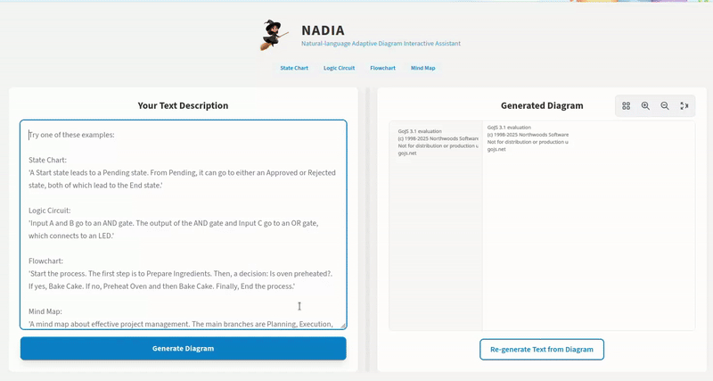

# **NADIA:**

NADIA (**N**atural-language **A**daptive **D**iagram **I**nteractive **A**ssistant is a _**text-to-interactive-diagram generation**_ tool. It creates inetractive diagrams (logic circuits/flowchart, mindmaps,..etc) using text, allow users to modify it and regenerate the text.



This project uses:
- A Python backend (Flask) to process user text via the Gemini API.
- A vanilla HTML/JS/CSS frontend to render interactive diagrams using GoJS.

---

## How to Run the Application

### 1. Set Up the Python Backend

#### a. Create a Virtual Environment
It is recommended to use a virtual environment to manage project dependencies.

```bash
# Navigate to your project directory
python -m venv venv
```

#### b. Activate the Virtual Environment

**On Windows (Command Prompt):**
```bash
.venv\Scripts\activate
```

**On macOS/Linux:**
```bash
source venv/bin/activate
```

#### c. Install Dependencies
Install all required Python packages using the `requirements.txt` file.

```bash
pip install -r requirements.txt
```

#### d. Set Your API Key
Set your Google AI Studio API key as an environment variable.

**On Windows (Command Prompt):**
```bash
set GOOGLE_API_KEY="YOUR_API_KEY_HERE"
```

**On Windows (PowerShell):**
```bash
$env:GOOGLE_API_KEY="YOUR_API_KEY_HERE"
```

**On macOS/Linux:**
```bash
export GOOGLE_API_KEY="YOUR_API_KEY_HERE"
```

Note: Replace `"YOUR_API_KEY_HERE"` with your actual key. This variable is only set for the current terminal session.

#### e. Run the Flask Server
Start the backend server.

```bash
python app.py
```

You should see output indicating that the server is running, typically on:

```
http://127.0.0.1:5000
```

Keep this terminal window open while using the frontend.

---

### 2. Launch the Frontend

#### a. Open the HTML File
Open the `index.html` file in your web browser (such as Chrome, Firefox, or Edge).  
You can usually do this by double-clicking the file in your file explorer.

---

### 3. Use the Tool

With the server running and the HTML file open in your browser, type a description into the text area and click **"Generate Diagram"** to create your interactive diagram.

---

## Project Summary

NADIA allows users to:
- Input natural language descriptions.
- Generate dynamic, editable diagrams in real time.

---

**Author:** Omar Hamed 
**License:** MIT  
**Technologies:** Flask, Gemini API, GoJS, HTML, CSS, JavaScript
